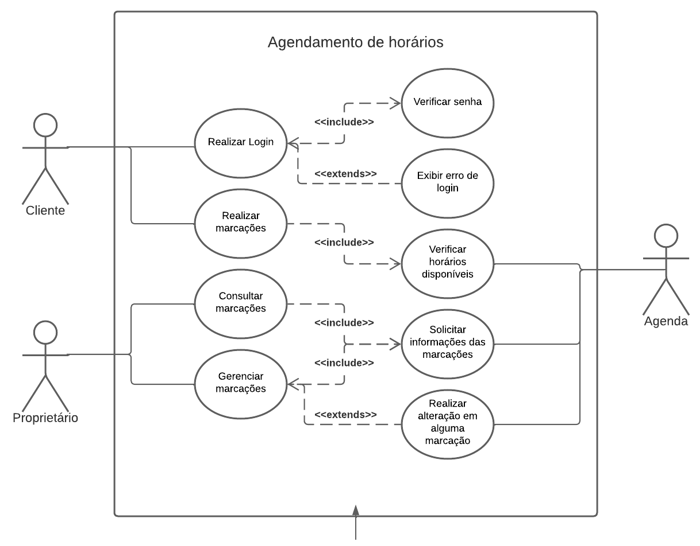

# Especificações do Projeto

Pré-requisitos: <a href="1-Documentação de Contexto.md"> Documentação de Contexto</a>

Definição do problema e ideia de solução a partir da perspectiva do usuário. É composta pela definição do  diagrama de personas, histórias de usuários, requisitos funcionais e não funcionais além das restrições do projeto.

Apresente uma visão geral do que será abordado nesta parte do documento, enumerando as técnicas e/ou ferramentas utilizadas para realizar a especificações do projeto

## Personas

Carlos Brito tem 31 anos, e começou como cabelereiro realizando cortes em seus amigos e familiares, atualmente ele já possui seu próprio ponto e possui mais três pessoas trabalhando juntamente com ele, seus hobbies são carros e motos antigas, e realizar trilhas e viagens com seus amigos.

Jhonatan Rodrigues tem 25 anos e é um dentista recém formado, atualmente ele está abrindo sua clínica com alguns amigos que fez durante a faculdade, como seus hobbies ele tem o esporte, ao menos uma vez na semana ele sempre se reúne com seus amigos para um jogo e nunca perde uma partida do seu time do coração.

## Histórias de Usuários

Com base na análise das personas forma identificadas as seguintes histórias de usuários:

|EU COMO... `PERSONA`| QUERO/PRECISO ... `FUNCIONALIDADE` |PARA ... `MOTIVO/VALOR`                 |
|--------------------|------------------------------------|----------------------------------------|
|Carlos Brito        |Ter uma agenda com as reservas dos meus clientes (RF-01)|Ter organização nos meus horários|
|Carlos Brito        |Poder reservar um determinado horário na agenda para um cliente (RF-03)|Atender com mais praticidade os clientes e ter mais aproveitamento de tempo|
|Carlos Brito        |Poder visualizar os proximos dias e os dias passados na minha agenda (RF-04)|Me organizar melhor para minhas próximas atividades e aproveitar melhor meu tempo|
|Jhonatan Rodrigues  |Um software que me auxilie a ver os horários e reservas da minha equipe (RF-01)|Melhorar o aproveitamento de tempo e o rendimento da minha equipe|
|Jhonatan Rodrigues  |Poder alterar o horário ou cancelar uma reserva ja realizada na agenda (RF-05)|Ter praticidade caso ocorra algum imprevisto com meus horários|
|Carlos Brito        |O sistema deve ter a funcionalidade de cadastro e login de clientes (RF-02)|Ter mais organização e praticidade para os clientes|

## Requisitos

As tabelas que se seguem apresentam os requisitos funcionais e não funcionais que detalham o escopo do projeto.

### Requisitos Funcionais

|ID    | Descrição do Requisito  | Prioridade |
|------|-----------------------------------------|----|
|RF-01| O sistema deve apresentar na página principal uma agenda padrão para realizar a reserva do horário | ALTA  | 
|RF-02| O sistema deve apresentar a funcionalidade de cadastro e login de usuário | ALTA  |
|RF-03| O site deve permitir ao usuário realizar uma marcação em um determinado horário na agenda | MÉDIA |
|RF-04| O site deve possibilitar o usuário pesquisar e visualizar o histório de marcações na agenda | MÉDIA |
|RF-05| O site deve permitir o administrador gerenciar as marcações criadas na agenda | MÉDIA |

### Requisitos não Funcionais

|ID     | Descrição do Requisito  |Prioridade |
|-------|-------------------------|----|
|RNF-01| O site deve ser publicado em um ambiente acessível publicamente na Internet (Repl.it, GitHub Pages, Heroku) |  ALTA  | 
|RNF-02| O site deverá ser responsivo permitindo a visualização em um celular de forma adequada |  ALTA  | 
|RNF-03| O site deve ter bom nível de contraste entre os elementos da tela em conformidade  |  MÉDIA | 
|RNF-04| O site deve ser compatível com os principais navegadores do mercado (Google Chrome, Firefox, Microsoft Edge) |  ALTA  | 

## Restrições

O projeto está restrito pelos itens apresentados na tabela a seguir.

|ID| Restrição                                             |
|--|-------------------------------------------------------|
|01| O projeto deverá ser entregue até o final do semestre |
|02| Não pode ser desenvolvido um módulo de backend        |
|03| A equipe não pode subcontratar o desenvolvimento do trabalho|

## Diagrama de Casos de Uso

O diagrama de casos de uso é o próximo passo após a elicitação de requisitos, que utiliza um modelo gráfico e uma tabela com as descrições sucintas dos casos de uso e dos atores. Ele contempla a fronteira do sistema e o detalhamento dos requisitos funcionais com a indicação dos atores, casos de uso e seus relacionamentos. 

